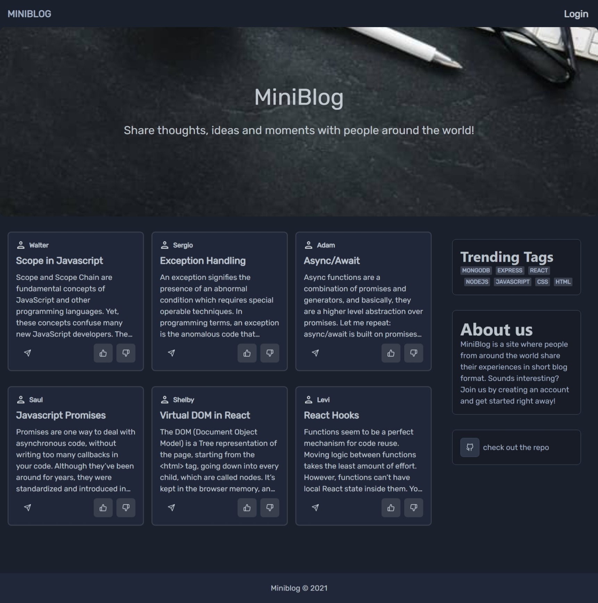
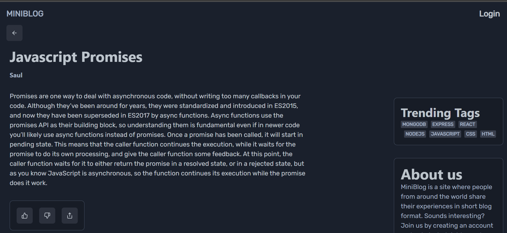
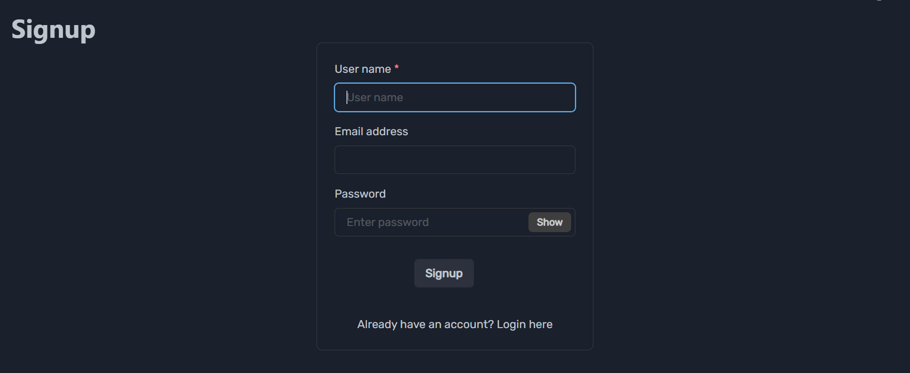
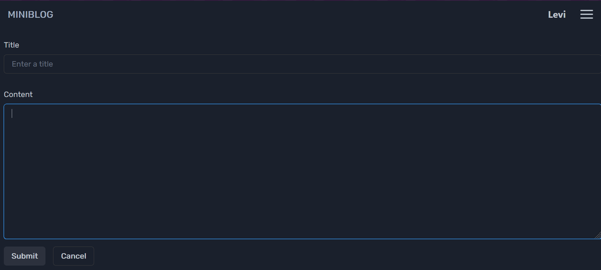

## MiniBlog

Fullstack Blog app I made to test out my skills in MERN stack and Context API

# Tech Used :

Frontend - React, Chakra UI, react-router-dom, axios
Backend - Express, MongoDB, bcrypt

# Screenshots :

*Home*

*Post*

*Signup*

*Write*

